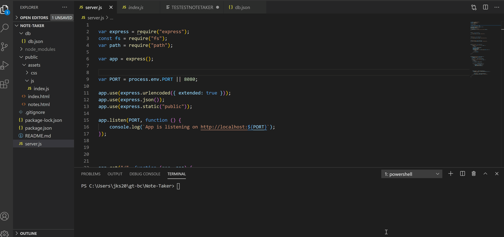

# Note-Taker

## Purpose

To create an app that takes notes, saves notes locally on click of the save icon, and deletes notes on click of the delete icon.

## Method

The Note-Taker app uses GET, POST, and DELETE to get routes to html files, db.json file, as well as post new updates to the db.json and delete from db.json. 

## Challenges

Along the way, a few challenges persisted. JSON was not easy to understand, and I ran into several errors, including "ERR_HTTP_HEADERS_SENT". After testing the code a few times and with help from other classmates as well as assists from AskBCS staff, I was able to fix this issue. Another issue that I ran into was sometimes objects would have the same ID, so when you targeted one to be deleted, it deleted both items with the same ID. To create a unique ID, I figured out that Date.now() served as a very useful tool in creating unique IDS for each object. Using this, I was able to solve that problem.

## Demonstration

## Conclusion/End Result

In conclusion, I was able to set the routes to html files, post, and delete updates as intended. The app performs as intended, and any potential errors are avoided by using unique IDS.

